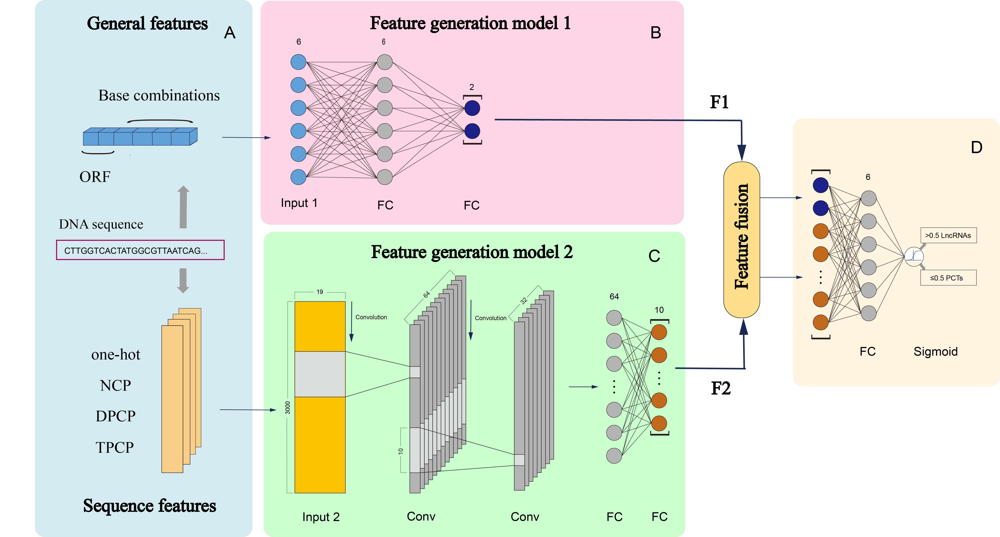

# DeepLnc-CNN

DeepLnc-CNN can effectively identify lncRNAs in both humans and mouse. This is part of the implementation of my Master's thesis (DOI: [10.27108/d.cnki.ghelu.2023.001223](https://doi.org/10.27108/d.cnki.ghelu.2023.001223)). 



## Installation

- <span  style="color: #5bdaed; font-weight: bold">[Python](https://www.python.org/)>=3.8</span>
- [Pytorch](https://pytorch.org/)>=1.8.2
- [NumPy](https://numpy.org/)>=1.21.5
```
git clone https://github.com/zhangtian-yang/DeepLnc-CNN.git
cd DeepLnc-CNN
pip install -r requirements.txt
```

## Example

```
python DeepLnc-CNN.py -i Example.txt -o output.html -s Human -ts 0.5
```

## Optional arguments

```
  -h, --help            Show this help message and exit.
  --addresses ADDRESSES
                        Tianyang.Zhang819@outlook.com
  -i INPUTFILE, --inputFile INPUTFILE
                        -i input.txt (The input file is a complete Fasta
                        format sequence. The input should not contain 
                        characters other than 'ATGC'.)
  -o OUTPUTFILE, --outputFile OUTPUTFILE
                        -o output_prediction.html (Results of predicting 
                        lncRNAs are saved under results folder.)
  -s SPECIES, --species SPECIES
                        -s Human/Mouse (Choose one from two species to
                        use.)
  -ts THRESHOLD, --threshold THRESHOLD  
                        -ts 0.5(Prediction result threshold)
```

## Acknowledgements

DeepLncPro uses and/or references the following separate libraries and packages (ordered alphabetically):

- [NumPy](https://numpy.org/)
- [Pytorch](https://pytorch.org/)
  
Thanks for all their contributors and maintainers!
***
Version number：V1.0 <br>
Updated date：2023-11-17 <br>
***
